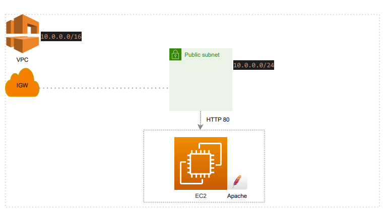
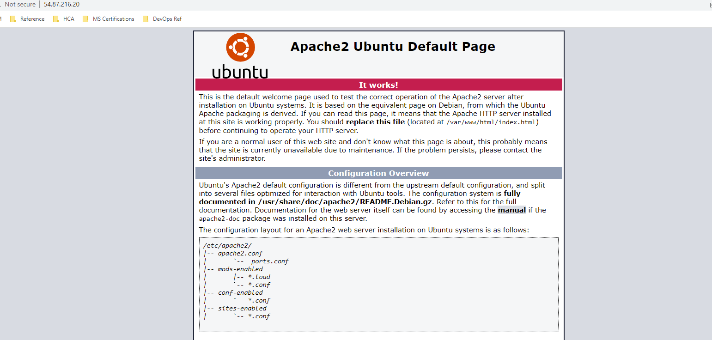
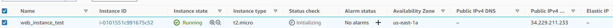
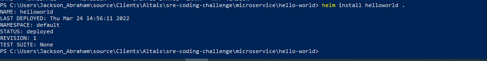
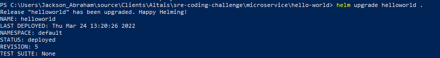
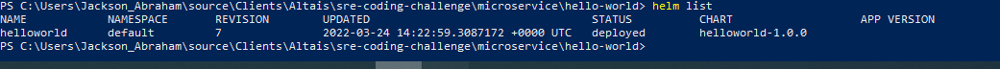
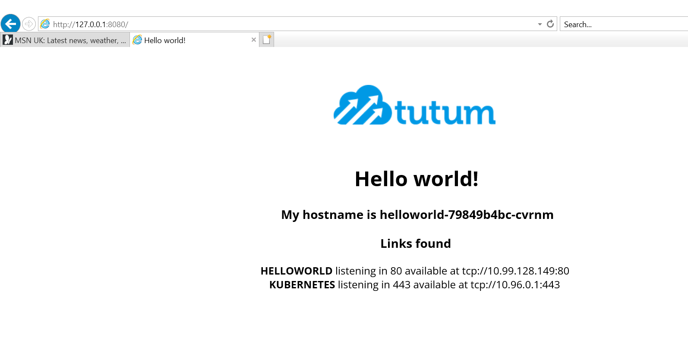

# sre-coding-challenge

## Description
A guideline to setup the terraform configuration and how to run terratest test suite.

### Dependencies

terraform = 1.1.3
go 1.17.4
helm

### Step by step

* Log-ing to aws console and create an IAM user with enough priviledges.
* Gather the AWS_ACCESS_KEY_ID and AWS_SECRET_ACCESS_KEY and set them as env variables 
```
export AWS_ACCESS_KEY_ID="<AWS_ACCESS_KEY_ID>"
export AWS_SECRET_ACCESS_KEY="<AWS_SECRET_ACCESS_KEY>"
```
* s3 with sns-notification configuration and the vpc, subnet, ec2, igw, security groups for the webserver 
```
navigate to usage/s3_sns directory

terraform init
terraform plan --var-file=params.tfvars
terraform apply --var-file=params.tfvars

navigate to usage/webserver

terraform init
terraform plan
terraform apply
```
* To run the unit test developed using terratest, run the following commands in the module/s3_sns/tests directory

```
go mod init
go mod tidy -compat=1.1
go test -v -run -timeout 30m

```
 
### Architecture of webServer:



### Apache Web Server Implementation Screenshots:






### Helm Microservice

To install the hello-world web app using helm, navigate to the helloworld directory:

```

helm install hello-world

```


```

helm upgrade hello-world

```


```

helm list

```



sample app hello-world on browser



## Author

Jackson Abraham 
